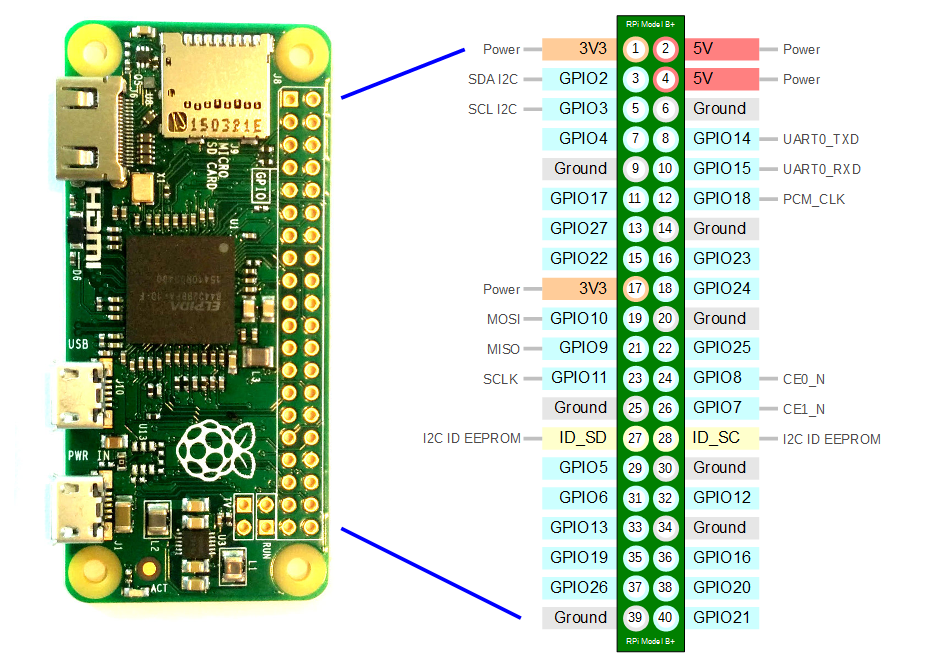

# Freezerbot Sensor Firmware (Raspberry Pi)

## Raspberry Pi OS Lite Config
Raspberry Pi OS Lite is the best choice for this use case as it is lightweight and we will not need the GUI.

Configuration of the OS is required for the hardware in this guide to work with the raspberry pi.

- ```bash
  sudo apt get update && sudo apt install hostapd dnsmasq
  ```
- Create `/etc/rc.local` script with contents:
  - ```bash
    #!/bin/bash
    sudo /home/pi/setup-freezerbot.sh
    exit 0
    ```
- Make it executable
  - ```bash
    sudo chmod +x /etc/rc.local
    ```
- Enable I2C interface with `sudo raspi-config`
- Create file called `/home/pi/setup-freezerbot.sh` with contents:
  - ```bash
    #!/usr/bin/env bash
    set -euo pipefail
    PATH="$PATH:/usr/local/sbin:/usr/local/bin:/usr/sbin:/usr/bin:/sbin:/bin"
    if [ ! -d /home/pi/freezerbot ]
    then
      git clone https://github.com/mycarrysun/freezerbot-sensor-rpi.git /home/pi/freezerbot
    fi
    
    cd /home/pi/freezerbot
    if [ ! -f device_info.json ]
    then
      sudo ./install.sh
    fi
    ```
- Add `dtoverlay=w1-gpio,gpiopin=11` to the `[all]` section in `/boot/firmware/config.txt`
  - If you're using a different GPIO pin for the temperature sensor, change the `gpiopin` to match
- (Only using PiSugar Battery) Install PiSugar Power Manager software:
  - ```bash
    wget https://cdn.pisugar.com/release/pisugar-power-manager.sh
    bash pisugar-power-manager.sh -c release
    ```

## Hardware Wiring

Components:
- Raspberry Pi Zero W/2W
- Momentary push button with built-in LED (waterproof, 12mm, 3-6V)
- Temperature sensor (DS18B20 or similar)
- (Optional) [PiSugar 2 Battery Hat](https://www.pisugar.com/products/pisugar2-raspberry-pi-zero-battery)
- Case with button mounting hole

GPIO Connections:


1. Button with Built-in LED (typically has 4 pins):
   - LED Positive (+) → GPIO 27 (pin 13)
   - LED Negative (-) → GND (pin 20)
   - First NO terminal → GPIO 17 (pin 11)
   - Second NO terminal → GND (pin 14)

2. Temperature Sensor (DS18B20):
   - Connect VCC to 3.3V (pin 17)
   - Connect GND to GND (pin 25)
   - Connect DATA to GPIO 11 (pin 23)
   - Connect a 4.7k pull-up resistor between DATA and VCC

Installation:
1. Mount the Raspberry Pi inside the case
2. Install the button in the case hole, ensuring the LED is visible
3. Connect all components according to the wiring diagram
4. Power on the Raspberry Pi with a micro USB power supply

Notes:
- The button should be easily accessible to users for resetting
- Since the button has a built-in LED, positioning is important for visibility
- Many illuminated buttons have terminals labeled: typically "NO" (Normally Open) 
  and "C" (Common) for the switch, and "+" and "-" for the LED
- No external resistor is needed for the LED as it has a built-in resistor
- Consider adding a label near the button indicating "Hold 10 seconds to reset"
